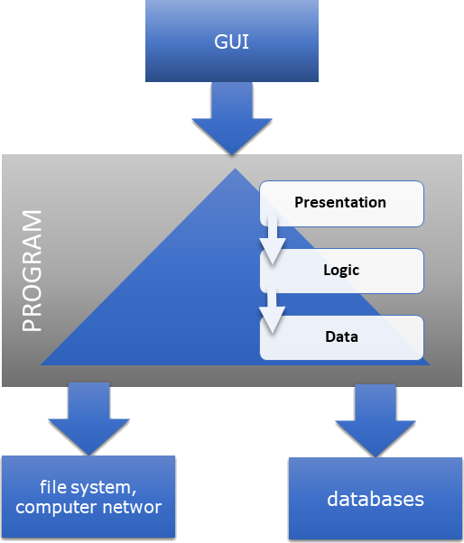
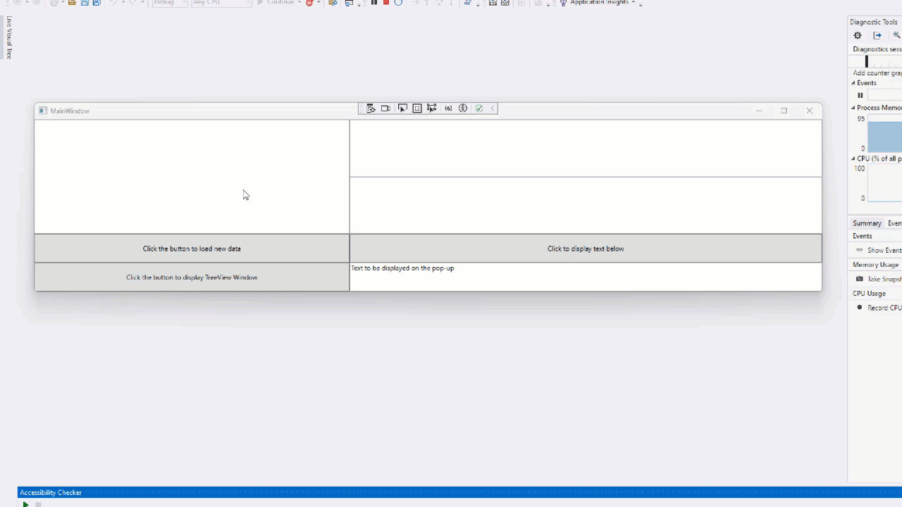
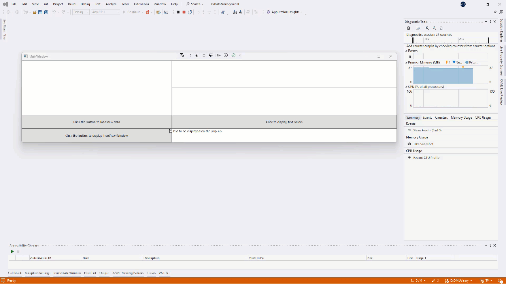

<!--
//____________________________________________________________________________________________________________________________________
//
//  Copyright (C) 2023, Mariusz Postol LODZ POLAND.
//
//  To be in touch join the community by pressing the `Watch` button and get started commenting using the discussion panel at
//
//  https://github.com/mpostol/TP/discussions/182
//
//  by introducing yourself and telling us what you do with this community.
//_____________________________________________________________________________________________________________________________________
-->

# Graphical User Interface (GUI)

- [Graphical User Interface (GUI)](#graphical-user-interface-gui)
  - [Preface](#preface)
    - [External Data](#external-data)
    - [GUI - Deployment](#gui---deployment)
    - [GUI - Tree of Controls](#gui---tree-of-controls)
  - [Starting Sample Program](#starting-sample-program)
    - [Master and Detailed View](#master-and-detailed-view)
  - [Entering Data](#entering-data)
  - [Pop-up window](#pop-up-window)
  - [Designing User Interface](#designing-user-interface)
  - [See also](#see-also)

## Preface

This folder concerns selected issues related to the representation of process information in graphical form. It tries to answer how to build a graphical user interface. Let's start with a few definitions, explanations, and indications of directions for searching for new solutions to improve the handling of graphic data.

### External Data

Let's start with a drawing used already several times to illustrate what we would talk about. In the figure below, the text of our program has been compiled, entered into memory, and has become a process managed by the computer's operating system. The operating system strongly defends the integrity of resources committed to the process. This defense measure is encapsulation. It forces to use the operating system when it is needed to exchange data with the external environment, including a remote or local computer screen.

The figure shows the program text as a layered structure. The reasons for the employment of layers have already been discussed. Previously, we talked about issues related to managing external data employing repositories. In general, three kinds of external data have been distinguished:

- **streaming**: files, network packets
- **structural**: databases
- **graphical**: Graphical User Interface (GUI)

The external data is determined as the data we must pull or push from outside the process hosting the computer program.

**Streams** provided by the file system are one of the options that we can use as a repository to gather the process data. In this case, data is stored as a stream of bits, which we can transform into process data and vice versa using serialization and deserialization operations.

Another option, which we also discussed in some detail, is **databases**, i.e. an external structured data management system (Database Management System, DBMS for short). The purpose of a DBMS is to consistently store and archive data in compliance with a certain scheme that allows for archiving complex data and creating relationships between individual entities of this data simultaneously. Data is accessed and processed by the DBMS using a certain query language.

In this section, the **graphical** representation of information is the main topic for discussion, i.e. graphical data in a form that allows communication by a computer with the environment. This forces us to place our considerations in the context of broadly understood natural language, in which, as the classic statement, “A picture is worth a thousand words”. This adage suggests that visual representations can convey complex ideas or emotions more effectively than lengthy descriptions. This phrase highlights the power of visual communication — a single image can represent complex ideas more effectively than lengthy descriptions.

### GUI - Deployment

Unfortunately, as usual, when we deal with a non-standard representation, we have to struggle with interpreting the meaning of the created image. This is often frustrating for developers because it could mean bad quality of their work when quality measures are unclear. Let me cite a situation while the team demonstrated a new application to our American partner. We were very proud of the application and the presentation went very well - we received much praise. There was only one major drawback - the dominating color of the style turned out to be un-American, even though we tried to apply those sent to us in a GIF form.

The information, or knowledge, represented by a certain image is read from by interpreting it. So creating graphics will require considering aesthetic impressions, which requires appealing to an undefined sense of beauty. The image must also meet the requirements of ergonomics, i.e. be adapted to the psychophysical capabilities of the user, i.e. a human being. This requires knowledge in the domains of psychology, sociology, physiology, hygiene, medicine, anthropometry, and technical sciences, e.g. machine construction. Without a doubt, a computer is a machine. Moreover, each program implements a certain algorithm, i.e. a knowledge of how to automate a selected process. Therefore, the behavior of the screen, which becomes the dashboard controlling the course of this process, must be directly related to this process, and this requires domain knowledge related to the process.

The list of fields involved in human-machine communication included computers, and this is our stuff, to put it colloquially. The image on its screen must be the result of our program. A program is a text created by a programmer, and a programmer is not a Superman who knows everything I have just mentioned, especially which colors are American, so let me return to the real-life anecdote I mentioned earlier.

Hence, how to involve other specialists, including but not limited to direct users, in the GUI design process should be our first **problem**. Let's go back to the national colors anecdote again, if we don't know what the American color means, let's give our friend from overseas a chance to prove herself. But let's not exaggerate and do not require technical knowledge from her, especially knowledge of a programming language.

### GUI - Tree of Controls

An image is a composition of colored pixels. They must be composed in such a way as to represent selected process information, i.e. its state or behavior. Similarly to the case of data in memory, which we process without directly referring to their binary representation, we do not create a GUI by laboriously assembling pixels into a coherent composition. Moreover, as I mentioned earlier, the GUI is a dashboard controlling the process, so it must also behave dynamically, including data entry and events handling.

Hence, The next **problem** is how to ensure the appropriate level of abstraction, i.e. how to hide the details related to maintaining an image on the screen. Let's introduce two concepts here: control and rendering. Hiding details always leads to coming to terms with the fact that something is happening beyond our control. We've seen this while generating SQL queries from LINQ expressions. As with LINQ, we need to use a specific technology to express our considerations in a practical context backed by examples. I chose Windows Presentation Foundation (the more familiar-sounding abbreviation WPF), but I will try not to lose the generality of the discussion. A discussion of WPF requires a separate course, and we will stay as close as possible to issues related to the practice of using the CSharp language.

To stay close to any programming language we need to focus our discussion on types. Returning to the question of what is control in a programming language, only one answer looks feasible, namely, it is a type that encapsulates user interface functionality that is used in client-side applications. This type has associated shape and responsibility to be used on the graphical user interface. In other words, by design, a control is a class. Many derived classes are inherited from it, for example, the `Button` class. This type has an associated button shape and click event handling responsibility to be used on the computer screen.

Unfortunately, we cannot completely avoid **problems** related to the design environment used, so Visual Studio and employing a domain-specific language, [Extensible Application Markup Language][XAML], XAML for short. Unfortunately, learning this language is beyond the scope of this paper. However, I must reassure you that detailed knowledge of the XAML is not a condition for understanding any of the issues discussed.

## Starting Sample Program

The best way to illustrate the basic issues related to representing process information using a graphical user interface is to present them in the context of the user interface of a sample program. The sample code in the repository includes the [GraphicalData.View][View] project that contains the user interface and can be run as a standalone application. We can run it directly using the operating system interface. However, I suggest starting it from Visual Studio (Fig. bellow). There is a menu entry to launch a new instance in diagnostic mode. As a result, a process is created to which resources are allocated. We can observe this using diagnostic tools. Unfortunately, discussing how to use these tools is beyond the scope of this paper. Once again, the user interface presented here is not related to the specific needs of any process. It is also worth remembering its features and behavior because it will be analyzed in the context of the example program that implements it.

As we can see, it is a typical Windows application window in which we can distinguish the header and the necessary useful content. The header is a title, i.e. some text and two keys for scaling the window relative to the monitor screen and the third one for ending the process that runs our program.

As for aesthetic impressions, we will not delve into the topic. But of course, we can without any particular problem question the colors and say that they are not American. I refer again to the previous anecdote not to dwell on this issue, but to try to find a solution to this and hundreds of similar problems. Let this color is an illustration of issues related to interdisciplinary teamwork and the division of competencies related to the design of graphical representation of information. Using a few selected examples, I will show where we can expect problems. The main goal is to focus on programming language issues, so please forgive me for the brevity of the examples and the shallowness of the issues discussed.

These problematic issues probably include issues related to the ergonomics of this interface. The example is only for educational purposes, but even here a lot can be done in this respect. So I'll move on to functionality, i.e. data and behavior of this interface. These white rectangles are places where data is exchanged between the program instance and its user. These gray rectangles are buttons that change color when you hover the mouse over them, indicating that you can click them. Without worrying about the aesthetics of the solution, let's assume that the background color of the part of the window in which the data is displayed as a result of clicking one of the keys is not ideal, not to mention that it is not American and requires consultation with someone who knows what it should be like. We cannot assume that the consultant is a developer.

### Master and Detailed View

As a result of the mouse hovering on the data area, the background has changed, we can assume that they constitute a whole, so they are complex data. Complex data is an entity in which we can distinguish and select components. As an example of a problem related to the ergonomics of the solution, we can point out that grouping requires some action undertaken by a user. Hence, this grouping should always be visible. For a programmer, this grouping may not be obvious, and the need to graphically highlight the grouping may be an unconscious need.

Another feature of the user interface is revealed when you click on a complex data, which causes further details to appear in other parts of the interface. Here, ergonomics specialists will probably question the lack of relationship emphasis between selected data and complex data, i.e. how we know that on the right side we have details of what was selected on the left side.

## Entering Data

Hovering the mouse over another data area reveals another feature - the ability to enter new or modify current data. We see a case of modification on the screen. Here again, a question for ergonomics experts, not programmers: how does the user know that the text is editable?

After modifying the data, we can simulate the dynamic behavior of the interface, namely, clicking the button above the text starts the procedure for processing a new value for the selected data, in this case, confirmed by displaying a window signaling the end of the operation. Here we have another problem: how to ensure that the application is **responsive**, i.e. that the interface in question is not frozen when the requested operation takes a noticeably long time.

## Pop-up window

There is one more button left. He demonstrates a scenario where the content of a window is insufficient and you need to open a new modal window. While this window is open, users cannot interact with other parts of the program until they close it. I will use this window to demonstrate two scenarios. The first scenario is that the user interface may depend on the state, i.e., the history of previously performed operations. The second one is that the user decides what data he wants to see.

In the new window, the buttons are again gray rectangles, and the white rectangle on the right-hand side is the space reserved for displaying data. The buttons are gray, but one is shaded (inactive). To make it active, you need to click the upper button, which simulates a scenario in which two operations must be performed in sequence, i.e. performing a certain operation only creates a situation that enables the possibility of triggering another one. For example, you must select a file first to analyze the data. Of course, ergonomics comes into play again because there is a question that must be addressed, namely how to clearly show this dependency on the screen.

In this case, the data is simulated. On the right-hand side of this window, the data is displayed in the tree form that can be expanded to any depth. This may resemble a situation in which we dynamically download subsequent data from an external repository following the user's current needs. This scenario is useful when retrieving all the data leads to an infinite loop due to recursion (cyclic references), and the amount of data displayed depends on the user's needs.

## Designing User Interface

In the sample application, we saw two windows that have just served as a repository and user interface for input and output process data. Additionally, these windows made it possible to control the program's behavior. Since the program (i.e. the text) is responsible for all this, let's find the places in the program responsible for graphics rendering, exposing process data, and the behavior of the user interface. Now, we are only interested only in graphics rendering. We'll cover data and behavior in separate parts.

Without going into details, the project has a folder in which I have collected files responsible for rendering windows on the screen, i.e. creating their appearance based on the formal description in the program text. In other words, it is a complex process of converting the program text into a composition of pixels on the screen. Because it is a repeatable process, it can be completely automated.

Let's select the [MainWindow][MainWindow] file and in the mouse right-click context menu we see that it can be designed in `Blend` - whatever it means - let's choose this option. It takes a while and finally, we will see the appearance of our sample window in an independent editor called `Blend`.

Using this editor, we can deal with the color of a selected part of the user interface. As we can see, by clicking on the right panel, I can choose any color and fill the selected area with a gradient background, which involves filling with a smooth tonal transition between at least two colors. The shape of this filling can be straight or radial. So if someone is unsatisfied with one color, they can use the selected palette with just a few clicks. The important word here is clicks because it means that the mouse can be handed over to someone who knows what colors should be, returning for the last time to the anecdote - what is an American color? It can be done even remotely during a remote conference.

A slightly more difficult issue is emphasizing that we use buttons, i.e. clickable places on the screen. For this purpose, we will use margins that will reduce the size of the clickable area on the screen. Here you have to enter four numbers from the keyboard, so the matter is a bit more complicated, but it seems that anyone can handle it, regardless of their IT knowledge. Similarly, by emphasizing the importance of a button, we can change its color as before.

The proposed approach is a static solution, i.e. the selected colors and shapes cannot be treated as process data. The situation changes if the color selection is to be the result of a processing process, for example, we may change the background to a shade of red if the calculation results are above alarming value. Similarly, the screen can change if you want the button to appear only in certain situations. These colors and shapes represent process information, i.e. data that must change according to a certain relationship connecting data with the picture on the screen.

## See also

- [Extensible Application Markup Language][XAML]

[XAML]: README.XAML.md
[View]: https://github.com/mpostol/TP/tree/ExDMUdemy/ExDataManagement/GraphicalData/GraphicalData.View
[MainWindow]: https://github.com/mpostol/TP/blob/master/ExDataManagement/GraphicalData/GraphicalData.View/MainWindow.xaml
