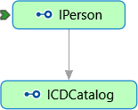
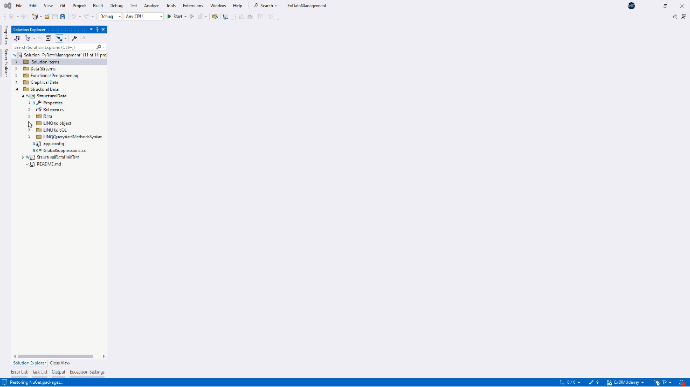
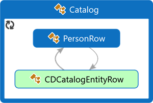

<!--
//________________________________________________________________________________________________________________
//  Copyright (C) 2024, Mariusz Postol LODZ POLAND.
//
//  To be in touch join the community by pressing the `Watch` button and get started commenting using the 
// discussion panel at https://github.com/mpostol/TP/discussions/182
//
//  by introducing yourself and telling us what you do with this community.
//________________________________________________________________________________________________________________
-->

# Structural Data

## In-process Structural Data

Generally speaking, we can say that data processing is carried out through the execution of operations. From this point of view, we can divide the data into:

1. **Simple data** - in this case, the data can be processed by a single operation, it is one action as a result of which the value is referred to as one whole. For example, changing the sign of an int variable.
2. **Complex data** – here the data is composed of components. Therefore, to operate on complex data we need a selector operation to select a component that is to be subject to an operation. The selection method is determined by the data type, e.g. index for arrays and field selection for class or structure.
3. **Structured data** - by design, the distinguishing feature is that individual data items in a structure are selected based on intentionally programmed relationships between items.

This section is focused on structural data. Let's analyze this case using sample code in the context of intentionally programmed relationships between items. As an example consider the [IPerson][IPerson] and [ICDCatalog][ICDCatalog] interfaces. Now let's perform a graphical analysis of the code. They are abstract definitions but a reference between interfaces in the diagram could be distinguished.



Because the mentioned interfaces are abstract definitions, they must be implemented first to instantiate a graph of objects based on them. We will analyze a few different implementations of them. Despite the differences, they always represent the same structure built up using reference types added to the [IPerson][IPerson] definition and mentioned in the following line:

``` CSharp
    IEnumerable<ICDCatalog> CDs { get; }
```

The [Person][Person] and [CDCatalog][CDCatalog] classes are example implementations of them, which are defined in the [TestDataGenerator][TestDataGenerator] class. It is worth stressing here that it is a fully manual implementation. In the referred snippet, the [Person][Person] class contains a representation of a set of albums released by one author, so it has references to instances of the [CDCatalog][CDCatalog] type. This code snippet is included in the unit test project and used later to analyze the next use case of creating a similar structure but using a dedicated embedded tool this time.

Now, let's perform a graphical analysis of the presented code. We can see the same reference between classes in the diagram. This relationship is inherited from the interface definition. As a result, the concrete classes can be used to create structured data, i.e. a certain group of objects interconnected by references. This group is often called a graph.


This approach is dedicated to be used for modeling in-process data. At run-time, in-process data refers to data that occurs and is maintained within the boundaries of a single operating system process. At design time it must be formally described by types. This design activity may be recognized as data modeling. In the case of object-oriented programming, it delivers an object model, i.e. a group of interconnected types definitions. Unfortunately, by design maintained by the program in-process data is limited only to necessary or relevant for further processing data. Deployment of communication, archival, and user interface access to external data is also required. Continuing discussion on the main topic, namely external data management the main goal of this section is to continue this discussion in the context of structural data.

## DataSet to create structural data

An alternative way to create in-process structured data is to use a dedicated editor that allows you to define data using a graphical interface. To start working, add the `DataSet` component, which can be found in the set of available Visual Studio components, in a selected place in the project. It is easier to find them if we limit the number of displayed components by selecting Date in the category tree. Using this approach - for comparison - I propose to define a functionally equivalent data structure to the one discussed previously. Let's call it `Catalog`.


Once created, the new multi-component item appears in the selected location. By double-clicking on the element grouping these components, the graphic editor appears. It allows you to add data tables, and their rows and define relationships between them. I have initially prepared two `DataTable` items, similar to the classes from the previous example. I also defined the relationship between them as before. We can also edit the properties of this relationship in a separate editor window, which we open from the context menu. I will use the previously defined classes in unit tests to initialize the data structure, which confirms their equivalence from the point of view of the represented information.



Designing this structure results in automatically generated program text that implements it in a partial class. We see that this time the program contains multiple classes, each representing dedicated information. The entire structure is represented by the [Catalog][CatalogDataSet] class, and all others are defined as its internal class definitions. The author is represented by a class named [PersonRow][PersonRow], and the CD is represented by [CDCatalogEntityRow][CDCatalogEntityRow].

Since the [Catalog][CatalogDataSet] class is a partial class, we can implement custom functionality in a separate file. As before, there are three methods implementing the same algorithm in three different ways, namely selecting a list of people indicated by the method parameter. We will return to these implementations in the context of unit tests, which we will use for a more detailed comparative analysis of these three implementations.

Since the generated text of the [Catalog][CatalogDataSet] class is over 1000 lines, I now suggest analyzing it using the Show on Code Map function. The resulting graphical representation of the text describes the content of the generated classes and shows the relationships between them. The goal of the analysis is to find similar relationships that we had previously in classes created manually.



Analysis using this tool requires an appropriate configuration of filters so that only the most important components of the definition appear on the screen. In this case, we are looking for the [PersonRow][PersonRow] class and a component that provides relationships to objects of the [CDCatalogEntityRow][CDCatalogEntityRow] class. This many-to-one relationship between [PersonRow][PersonRow] and [CDCatalogEntityRow][CDCatalogEntityRow] is implemented as the [GetCDCatalogRows][GetCDCatalogRows] method, which returns an array of objects of type [CDCatalogEntityRow][CDCatalogEntityRow].

``` CSharp
            public CDCatalogEntityRow[] GetCDCatalogRows() {
                if ((this.Table.ChildRelations["ArtistRelation"] == null)) {
                    return new CDCatalogEntityRow[0];
                }
                else {
                    return ((CDCatalogEntityRow[])(base.GetChildRows(this.Table.ChildRelations["ArtistRelation"])));
                }
            }
```

Let's now move on to finding the relationship in the opposite direction, namely the relationship that will connect the CD with its author. And again, we need to properly configure the display filters to make the image readable for this presentation. In the [CDCatalogEntityRow][CDCatalogEntityRow] class, the one-to-one relationship connecting the corresponding [PersonRow][PersonRow] object is implemented by a property with the same name as the target class, namely [PersonRow][PersonRow].

Let us now move on to the analysis of the added methods in the context of unit tests filtering data from the structure created in this way. These methods are located as components of the [Catalog][CatalogDataSet] class, or rather in its internal class [PersonRow][PersonRow].

## External Repositories

In general, the data managed by external repositories can be grouped as follows:

- Bitstreams offered by the file system and network
- Data structures offered by database management systems

Topics related to the use of bitstreams have already been discussed and we will not return to them now. So let's go straight to discussing issues in the context of accessing external repositories managed structural data.

We already answered the question of what structured data is and how to process it as part of the process responsible for hosting our program. External data means that it is managed by an independent process. This process has two tasks: data sharing and data processing. This requires that it has allocated resources, such as processor, memory, files, network, etc. Consequently, we must talk about a database management system. An example is a relational database. In a relational database, data is processed using SQL. SQL stands for Structured Query Language.

Unlike files, a DBMS allows you to share data. This means that if we want to use the file we have to open it and as a result, it is locked for exclusive use by the modifying process. There is no such limitation for databases, but access to data is carried out using queries. Such queries can be handled sequentially ensuring data consistency.

There is a fundamental difference between operating on streaming and structured data managed by an external system:

- By design, streaming data is serialized and deserialized into local structured data as an entity stored in a file
- Access to external structured data is provided through queries that are carried out in the DBMS process, i.e. remotely, and data processing can take place both remotely and locally.

Usually, in the case of data sequences, for example, a sequence of records from a personal database, we process them iteratively, i.e. we repeat selected activities for each element of the sequence, starting from the first element up to the end of the sequence. The need to perform queries remotely via the DBMS forces the process to be divided into two stages:

- selection of data that meets a certain criterion
- processing only preselected data locally

In the case of external data repositories, we have no alternative to this scenario. However, in practice, it also turned out that such an approach is a good scenario when operating on local in-process data gathered the working memory of the program.

## See also

- [Language Integrated Query (LINQ)](https://docs.microsoft.com/dotnet/csharp/programming-guide/concepts/linq)
- [Query Syntax and Method Syntax in LINQ (C#)](https://docs.microsoft.com/dotnet/csharp/programming-guide/concepts/linq/query-syntax-and-method-syntax-in-linq)
- [LINQ to SQL tools in Visual Studio](https://docs.microsoft.com/visualstudio/data-tools/linq-to-sql-tools-in-visual-studio2?view=vs-2017)
- [LINQ to SQL](https://docs.microsoft.com/dotnet/framework/data/adonet/sql/linq/)
- [Entity Framework Documentation](https://docs.microsoft.com/ef/)

[IPerson]: StructuralData/Data/IPerson.cs#L16-L22
[ICDCatalog]: StructuralData/Data/ICDCatalog.cs#L14-L19
[CatalogDataSet]: StructuralData/LINQ%20to%20object/Catalog.Designer.cs#L25-L1304
[PersonRow]: StructuralData/LINQ%20to%20object/Catalog.Designer.cs#L1136-L1235
[CDCatalogEntityRow]: StructuralData/LINQ%20to%20object/Catalog.Designer.cs#L959-L1131
[GetCDCatalogRows]: StructuralData/LINQ%20to%20object/Catalog.Designer.cs#L1227-L1234

[TestDataGenerator]: StructuralDataUnitTest/Instrumentation/TestDataGenerator.cs#L17-L73
[Person]: StructuralDataUnitTest/Instrumentation/TestDataGenerator.cs#L29-L58
[CDCatalog]: StructuralDataUnitTest/Instrumentation/TestDataGenerator.cs#L60-L70
